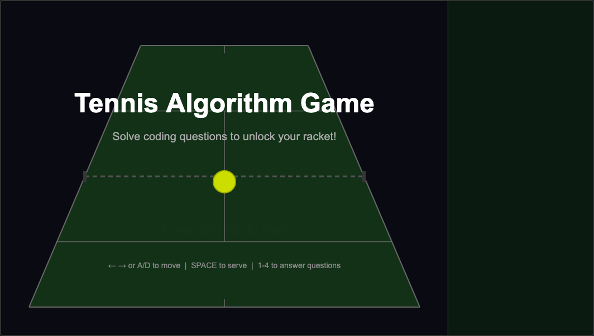

# Tennis Algorithm Game

A tennis game you play in your web browser. Answer programming questions to unlock your racket and hit the ball back. No install needed - just one file.

## How to play

1. Download `tennis_game.html` (click the file above, then click the download button).
2. Open it in any web browser (Chrome, Firefox, Safari, Edge).
3. Press SPACE to start.

## Controls

- **Arrow keys** or **A/D**: move your racket left and right
- **SPACE**: serve the ball
- **1/2/3/4** or **click**: answer questions

## Rules

- The CPU hits the ball toward you.
- A programming question pops up - answer it correctly to unlock your racket.
- If you get it wrong or run out of time, the CPU scores a point.
- Full tennis scoring: points, games, sets. Best of 3 sets wins the match.

## Question categories

- Python
- JavaScript
- HTML/CSS
- SQL
- General computer science

## License

MIT. See [LICENSE](LICENSE) for details.

## Author

Neil Voss - https://bsky.app/profile/neilvosslab.bsky.social
